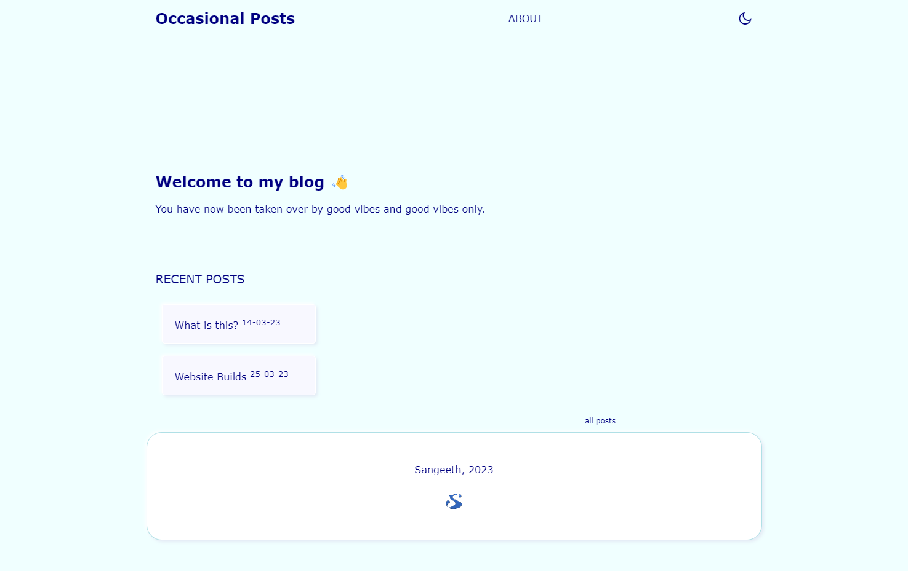

# Website Builds
---

In  my last post I said I was using [Publii](https://getpublii.com/)[^1] to push my posts, [GitHub](https://github.com/) for the storage and [Cloudflare Pages](https://www.cloudflare.com/) as my deployment. 

My reasons for doing so were the following:
* I wanted to remove hosting costs associated with my blog[^2] - thus opting to have the site public on GitHub and deploy it with Cloudflare[^3].
* Move away from WordPress and use a headless CMS, where I had full control over my posts.
* A way to write using Markdown. 
* Full control over the entire site - design, formatting, etc. etc.

The first version of the site was nice, but I was having issues theming the site. Publii uses a theming format called Handlebars[^4], and it's own taxonomy for posts. Once I had Publii and Github set up and running, I ran into my next problem, which was that I felt like I still didn't have as much ownership of the site as I'd like (nothing wrong with Publii if all you want to do is write posts and publish them without worrying about what it will look like - Publii just works).

So I decided to start from scratch. I got [VS Code](https://code.visualstudio.com/) (Which I think is absolutely fantastic btw) and just started with a basic HTML5 template. I can detail the way I made the site in a later blog post.

Here's how the site is as of 25/03/2023:

There is some functionality missing (such as the dark mode toggle not working very well), and perhaps some further fixes I will need to do, but for the most part it is working. 

The site is still stored on Github Pages (and I can commit directly from VS Code), and Cloudflare still deploys it. However, now I have granular control and can choose the way my blog is presented. Although it takes a little bit longer to push a post (I write in Markdown, but have to convert it to HTML), I am happier. It looks like all my initial criteria has been fulfilled. 

[^1]: Publii is a offline CMS. Think WordPress for blogging, but stored on your computer. 
[^2]: The blog was hosted on a VPS on [Contabo](https://contabo.com/en). Contabo was great, but too much for simple blogging. 
[^3]: The choice of Cloudflare was a convenience one. I use it as my DNS manager, so less sites to keep track of. In reality, an other CDN service with a free option would do (Like [Netlify](https://www.netlify.com/), or [Vercel](https://vercel.com/)).
[^4]: Handlebars is not a difficult theming language. I just did not want to add more systems, and it felt like I was adding complexity to the site for no reason.